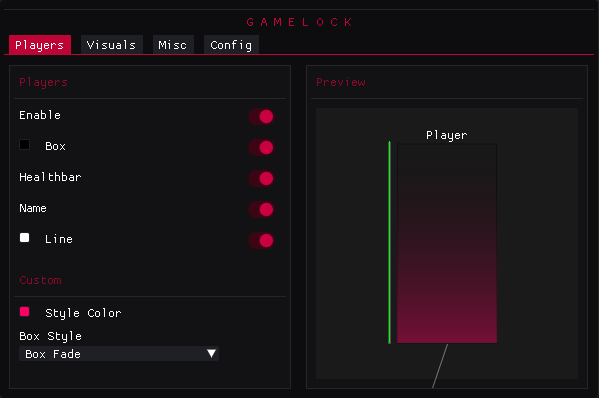

# ImGui Overlay Example (C#)



A lightweight **external ImGui overlay** built in **C#** demonstrating custom GUI features, example options, and a slightly customized Dear ImGui interface. This project is designed for **educational purposes**, showing how to integrate Dear ImGui into an external overlay environment.

---

## Features

- External overlay with ImGui interface  
- Customizable menu layout and colors  
- Example functional options demonstrating ImGui controls  
- Lightweight and modular design for easy extension  
- Built with **C#** and **Dear ImGui**

---

## Screenshots / Preview


*Above: Example of the overlay menu in action.*

---

## Getting Started

### Requirements
- .NET Framework / .NET Core compatible with your setup  
- Visual Studio 2019 or newer  
- Dear ImGui C# binding (included in the project)

### Build Instructions
1. Clone this repository:

```bash
git clone https://github.com/matheusc9/External-ImGui.git
